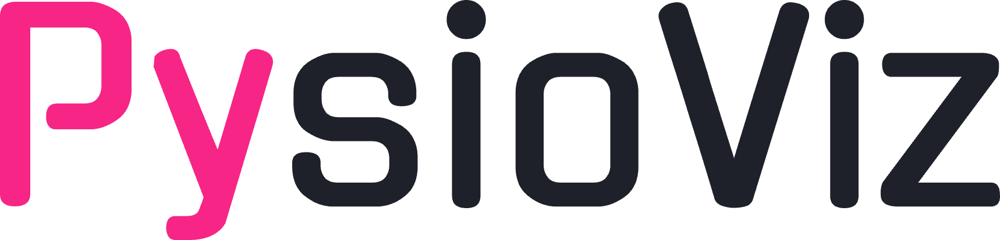

<h1 align="center">
  <picture>
    <!-- Source for dark mode -->
    <source media="(prefers-color-scheme: dark)" srcset="images/logo_dark.png" media="(width = 60%)">
    <!-- Fallback image for light mode and other clients -->
    
  </picture>

  <br>
  Multimodal Physiological Data Visualization and Annotation Dashboard
</h1>

Locally run dashboard for visualization, inspection and annotation of realtime physiological, health, and robotics distributed multimodal data captured with [HERMES](https://github.com/maximyudayev/hermes).

<!-- <p align="center">
  
</p> -->

## Installation
### GUI
1. Clone the repository
   ```bash
   git clone https://github.com/maximyudayev/pysioviz.git
   cd pysioviz
   ```

1. Install the project with UV
   ```bash
   uv sync
   ```

1. Adapt to your workstation
   1. Change path to the data folder in the `.vscode/launch.json`
   1. Rename data files in `main.py` as needed
   1. Change the hardware video codec to your system supported one
   1. [Install FFmpeg](#ffmpeg)
   1. Run out of VS Code in regular or debug mode

### FFmpeg
To process video files, you will have to install [FFmpeg](https://ffmpeg.org/).

#### Windows
1. Download the full build with shared libraries from [gyan.dev](https://www.gyan.dev/ffmpeg/builds/ffmpeg-release-full-shared.7z).
1. Unpack the archive into the desired folder, like `C:\Program Files\ffmpeg`.
1. Add path to the FFmpeg binaries to the `Path` environment variable manually, or via CMD. 
   ```powershell
   SETX PATH "%PATH%;C:\Program Files\ffmpeg\bin;C:\Program Files\ffmpeg" /M
   ```
1. Open a new terminal window and check that FFmpeg can be correctly found by the system `where ffmpeg`.

#### Linux
1. Install with the package manager `sudo apt-get install ffmpeg`.
1. Check that ffmpeg is on path `which ffmpeg`.

# License
This sourcecode is licensed under the MIT license - see the [LICENSE](https://github.com/maximyudayev/hermes/blob/main/LICENSE) file for details.

The project's logo is distributed under the CC BY-NC-ND 4.0 license  - see the [LOGO-LICENSE](https://github.com/maximyudayev/hermes/blob/main/LOGO_LICENSE.md).

# Citation
When using any component of this project in your research, project, or product, please cite the following and notify us so we can update the index of success stories enabled by [HERMES](https://github.com/maximyudayev/hermes).

<a href="https://arxiv.org/abs/2601.12610" style="display:inline-block;">
  
</a>

```bibtex
@preprint{yudayev2026hermes,
   title={HERMES: A Unified Open-Source Framework for Realtime Multimodal Physiological Sensing, Edge AI, and Intervention in Closed-Loop Smart Healthcare Applications}, 
   author={Yudayev, Maxim and Carlon, Juha and Lamsal, Diwas and Stefanova, Vayalet and Filtjens, Benjamin},
   year={2026},
   eprint={2601.12610},
   archivePrefix={arXiv},
   primaryClass={eess.SY},
   doi={10.48550/arXiv.2601.12610}, 
}
```

# Acknowledgement
The tool was developed by [Maxim Yudayev](https://www.linkedin.com/in/maxim-yudayev) and [Diwas Lamsal](https://www.linkedin.com/in/diwaslamsal123), while at the [e-Media Research Lab](https://iiw.kuleuven.be/onderzoek/emedia), Department of Electrical Engineering, KU Leuven.

The development was funded, in part, by the [AidWear](https://iiw.kuleuven.be/onderzoek/emedia/projects/AidWear) project funded by the Federal Public Service for Policy and Support, 
the [AID-FOG](https://iiw.kuleuven.be/onderzoek/emedia/projects/aid-fog) project by the Michael J. Fox Foundation for Parkinson’s Research under Grant No.: MJFF-024628,
the strategic basic research project [RevalExo](https://iiw.kuleuven.be/onderzoek/emedia/projects/revalexo) (S001024N) funded by the Research Foundation Flanders, 
and the Flemish Government under the [Flanders AI Research Program](https://www.flandersairesearch.be/en) (FAIR).

Special thanks for the support to [prof. Benjamin Filtjens](https://www.tudelft.nl/en/staff/b.filtjens/) (TU Delft) and [prof. Bart Vanrumste](https://linkedin.com/in/bart-vanrumste-1071744) (KU Leuven).
