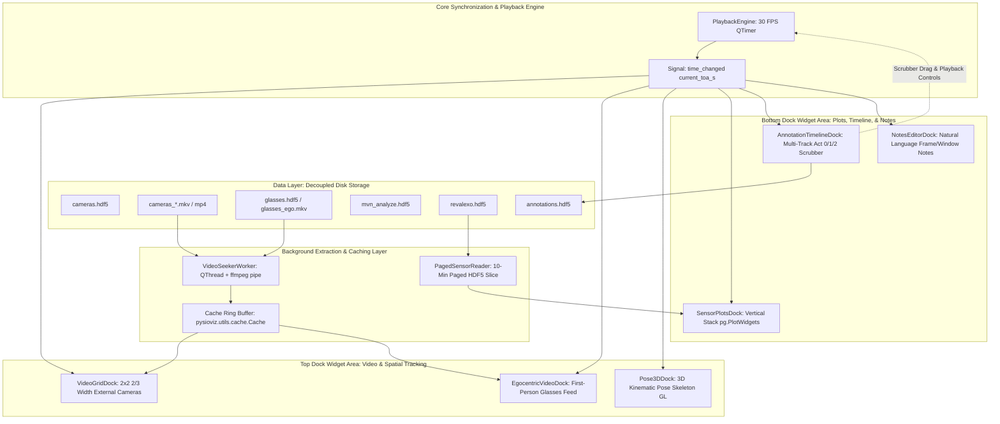

# PysioViz Annotation & Visualization Tool: Technical Walkthrough & Architecture Manual

This manual provides an in-depth architectural breakdown and developer guide for the **PysioViz** desktop visualization and annotation platform. It details how the framework operates and provides step-by-step instructions on modifying UI layout, video frame caching, activity label taxonomy, playback controls, and sensor pipelines.

---

## Table of Contents
1. [System Overview & Architecture](#1-system-overview--architecture)
2. [Source Code Hierarchy](#2-source-code-hierarchy)
3. [Video Frames Caching, Aspect Ratio, & Decoding Pipeline](#3-video-frames-caching-aspect-ratio--decoding-pipeline)
   - [Asynchronous Producer-Consumer Cache](#asynchronous-producer-consumer-cache)
   - [FFmpeg Decoding via Image Pipe & EOI Markers](#ffmpeg-decoding-via-image-pipe--eoi-markers)
   - [Aspect-Ratio Containers & Zero-Margin Layouts](#aspect-ratio-containers--zero-margin-layouts)
   - [Modality-Specific ToA vs Relative Time Readouts](#modality-specific-toa-vs-relative-time-readouts)
   - [Recipe: Modifying Cache & Video Extraction Settings](#recipe-modifying-cache--video-extraction-settings)
4. [Widget Tiling, Docking Hierarchy, & Proportional Layout](#4-widget-tiling-docking-hierarchy--proportional-layout)
   - [QMainWindow Dock Architecture & Corner Configuration](#qmainwindow-dock-architecture--corner-configuration)
   - [Top Row: 2/3 Video Grid, Egocentric Feed, and 3D Pose](#top-row-23-video-grid-egocentric-feed-and-3d-pose)
   - [Bottom Row: Side-by-Side Timeline and Notes](#bottom-row-side-by-side-timeline-and-notes)
   - [Preventing Size Hint Inflation](#preventing-size-hint-inflation)
   - [Recipe: Adding, Removing, or Rearranging Docks](#recipe-adding-removing-or-rearranging-docks)
5. [Activity Label Taxonomy & Ground-Truth Annotation Pipeline](#5-activity-label-taxonomy--ground-truth-annotation-pipeline)
   - [Multi-Track Act 0/1/2 Architecture & ActivityMaskItem](#multi-track-act-012-architecture--activitymaskitem)
   - [Double-Click Drag Activation & Scrubbing Safety](#double-click-drag-activation--scrubbing-safety)
   - [Selection Highlighting & Mask Deletion](#selection-highlighting--mask-deletion)
   - [Relative Time Axis (HH:MM:SS.mmm) & Zooming Constraint](#relative-time-axis-hhmmssmmm--zooming-constraint)
   - [HDF5 Ground Truth Serialization](#hdf5-ground-truth-serialization)
   - [Recipe: Customizing or Dynamically Loading Activity Classes](#recipe-customizing-or-dynamically-loading-activity-classes)
6. [Playback Engine & Control Extensions](#6-playback-engine--control-extensions)
   - [Deterministic Synchronization Loop & Sweeping Throttling](#deterministic-synchronization-loop--sweeping-throttling)
   - [Signal-Slot Event Bus](#signal-slot-event-bus)
   - [Recipe: Adding New Control Buttons (Stop, Skip ±5s/±30s, Loop)](#recipe-adding-new-control-buttons-stop-skip-5s30s-loop)
   - [Recipe: Adding Keyboard Shortcuts](#recipe-adding-keyboard-shortcuts)
7. [Sensor Modalities & Lazy HDF5 Paging](#7-sensor-modalities--lazy-hdf5-paging)
   - [10-Minute Paged Data Windowing](#10-minute-paged-data-windowing)
   - [Recipe: Adding a New Sensor Modality Stream](#recipe-adding-a-new-sensor-modality-stream)
8. [Preprocessing & MoCap Deduplication Tools](#8-preprocessing--mocap-deduplication-tools)
   - [MVN Xsens Pose Counter Deduplication](#mvn-xsens-pose-counter-deduplication)
   - [CLI & Programmatic Usage](#cli--programmatic-usage)

---

## 1. System Overview & Architecture

PysioViz is a native desktop Qt6 framework developed for offline, post-hoc replay, alignment, and annotation of continuous multimodal recordings collected via the HERMES framework. It resolves DOM bloat and high memory footprints by combining native Qt graphics (`PyQt6`, `pyqtgraph`, `pyopengl`) with deterministic time indexing and lazy-loading buffers.



### Key Principles
1. **Universal Time-of-Arrival (`toa_s`) Alignment**: Modalities are aligned against a global session clock (`min_toa_s` to `max_toa_s`).
2. **Modality-Specific Sensor Timestamping**: Each widget displays the exact UTC `toa_s` of the sample retrieved from its own dataset (which differ by fractional milliseconds across hardware clocks).
3. **Experiment Elapsed Time (`HH:MM:SS.mmm`)**: All plot axes and time banners display elapsed time relative to the session start ($t_0 = \text{min\_toa\_s}$) in `hours:minutes:seconds.milliseconds`.
4. **Deterministic Playback Bus**: A single master [PlaybackEngine](/src/pysioviz/qt/playback_engine.py#L14) emits [time_changed](/src/pysioviz/qt/playback_engine.py#L17) signals. Views react independently by seeking nearest frames or paging sensor slices without locking the UI thread.
5. **Fully Modular Docking Hierarchy**: The user interface is composed entirely of [`QDockWidget`](/src/pysioviz/qt/main_window.py#L115-L150) instances, enabling flexible tiling, multi-monitor tearing, and customizable workspace proportions.

---

## 2. Source Code Hierarchy

The core Qt desktop application resides under [`src/pysioviz/qt/`](/src/pysioviz/qt/) and reuses data utility primitives from [`src/pysioviz/utils/`](/src/pysioviz/utils/):

| File Path | Primary Class / Component | Role & Functionality |
| :--- | :--- | :--- |
| [`main.py`](/main.py) | `main()` | CLI entrypoint, High-DPI flag configuration, app bootstrap. |
| [`src/pysioviz/qt/main_window.py`](/src/pysioviz/qt/main_window.py) | [PysiovizMainWindow](/src/pysioviz/qt/main_window.py#L25) | Root window, dock layout, corner mapping, proportional sizing, session loading, menu bar. |
| [`src/pysioviz/qt/playback_engine.py`](/src/pysioviz/qt/playback_engine.py) | [PlaybackEngine](/src/pysioviz/qt/playback_engine.py#L14) | Deterministic playback clock (30 FPS timer), play/pause, step forward/backward, speed multiplier, scrubber sweeping rate limiter. |
| [`src/pysioviz/qt/video_seeker.py`](/src/pysioviz/qt/video_seeker.py) | [VideoSeekerWorker](/src/pysioviz/qt/video_seeker.py#L22) | Dedicated `QThread` decoding frames on-demand via `ffmpeg image2pipe`, emitting frame-specific `toas` timestamps. |
| [`src/pysioviz/utils/cache.py`](/src/pysioviz/utils/cache.py) | [Cache](/src/pysioviz/utils/cache.py#L14) | Thread-safe asynchronous background frame buffer producing decoded frames ahead of playback. |
| [`src/pysioviz/utils/time_utils.py`](/src/pysioviz/utils/time_utils.py) | [format_relative_time](/src/pysioviz/utils/time_utils.py#L180) | Converts elapsed seconds into formatted `HH:MM:SS.mmm` strings with millisecond precision. |
| [`src/pysioviz/qt/time_axis_item.py`](/src/pysioviz/qt/time_axis_item.py) | [RelativeTimeAxisItem](/src/pysioviz/qt/time_axis_item.py#L10) | PyQtGraph bottom axis item formatting plot ticks as `HH:MM:SS.mmm` relative to experiment start. |
| [`src/pysioviz/qt/paged_sensor_reader.py`](/src/pysioviz/qt/paged_sensor_reader.py) | [PagedSensorReader](/src/pysioviz/qt/paged_sensor_reader.py#L12) | Lazy-loading HDF5 reader managing 10-minute paging windows to prevent multi-gigabyte RAM overhead. |
| [`src/pysioviz/qt/widgets/video_grid_dock.py`](/src/pysioviz/qt/widgets/video_grid_dock.py) | [VideoGridDock](/src/pysioviz/qt/widgets/video_grid_dock.py#L159), [AspectRatioContainer](/src/pysioviz/qt/widgets/video_grid_dock.py#L48), [CameraViewportWidget](/src/pysioviz/qt/widgets/video_grid_dock.py#L85) | 2x2 external camera grid with exact aspect ratio containers, zero margin gaps, and translucent badge overlays. |
| [`src/pysioviz/qt/widgets/egocentric_video_dock.py`](/src/pysioviz/qt/widgets/egocentric_video_dock.py) | [EgocentricVideoDock](/src/pysioviz/qt/widgets/egocentric_video_dock.py#L16) | Standalone dock for first-person wearable glasses feed with aspect-ratio container and glasses ToA badge. |
| [`src/pysioviz/qt/widgets/pose_3d_dock.py`](/src/pysioviz/qt/widgets/pose_3d_dock.py) | [Pose3DDock](/src/pysioviz/qt/widgets/pose_3d_dock.py#L41) | Standalone dock for 3D OpenGL kinematic skeleton (`pyqtgraph.opengl`), center-root tracking, and Xsens pose ToA readout. |
| [`src/pysioviz/qt/widgets/annotation_timeline_dock.py`](/src/pysioviz/qt/widgets/annotation_timeline_dock.py) | [AnnotationTimelineDock](/src/pysioviz/qt/widgets/annotation_timeline_dock.py#L173), [ActivityMaskItem](/src/pysioviz/qt/widgets/annotation_timeline_dock.py#L55) | Multi-track timeline (Act 0/1/2) with double-click activated dragging, highlight selection, delete options, and horizontal-only zooming. |
| [`src/pysioviz/qt/widgets/sensor_plots_dock.py`](/src/pysioviz/qt/widgets/sensor_plots_dock.py) | [SensorPlotsDock](/src/pysioviz/qt/widgets/sensor_plots_dock.py#L93), [SensorPlotItem](/src/pysioviz/qt/widgets/sensor_plots_dock.py#L17) | Vertical stack of synchronized `pg.PlotWidget` instances with relative time axes and sensor-specific ToA title headers. |
| [`src/pysioviz/qt/widgets/notes_editor_dock.py`](/src/pysioviz/qt/widgets/notes_editor_dock.py) | [NotesEditorDock](/src/pysioviz/qt/widgets/notes_editor_dock.py#L25) | Text annotations tied to discrete timestamps or temporal ranges, tiled side-by-side with the timeline. |
| [`src/pysioviz/qt/widgets/modality_dialog.py`](/src/pysioviz/qt/widgets/modality_dialog.py) | [AddModalityDialog](/src/pysioviz/qt/widgets/modality_dialog.py#L17) | Modal dialog for dynamically linking external HDF5 sensor streams at runtime. |

---

## 3. Video Frames Caching, Aspect Ratio, & Decoding Pipeline

Video extraction uses the approach from [VideoComponent.py](/src/pysioviz/components/data/VideoComponent.py#L85-L117) and [cache.py](/src/pysioviz/utils/cache.py#L14).

### Asynchronous Producer-Consumer Cache
The [Cache](/src/pysioviz/utils/cache.py#L14) class creates an internal FIFO queue (`collections.deque(maxlen=capacity)`) that prefetches decoded JPEG byte payloads in a background daemon thread (`self._cache_task.daemon = True`).
- **Initialization**: Triggered with a retrieval callable `self._get_frame(frame_id)` that requests frames sequentially from an active `ffmpeg` pipe.
- **Consumption**: The worker calls `cache.get_data(frame_id)`. If the frame is already in the deque, retrieval is $O(1)$. If a seek jump occurs outside the cached buffer window, `cache.get_data()` updates its internal read head, flushes the stale buffer, and signals the background thread via `threading.Event` to resume prefetching from the new index.

### FFmpeg Decoding via Image Pipe & EOI Markers
In [VideoSeekerWorker](/src/pysioviz/qt/video_seeker.py#L22):
1. **Pipeline Instantiation**:
   ```python
   buf, _ = (
       ffmpeg.input(filename=self.video_path, hwaccel=hwaccel, ss=timestamp_start)
       .output('pipe:', format='image2pipe', vframes=self._num_prefetch_frames)
       .run(capture_stdout=True, quiet=True)
   )
   ```
2. **Byte Boundary Delimitation**: JPEG frames written to `stdout` are delimited by the End-Of-Image marker `b'\xff\xd9'`.
3. **Sensor-Specific Timestamp Emission**: Instead of reporting the master timeline's requested clock time, the worker emits the exact timestamp of that frame from its underlying dataset:
   ```python
   actual_toa_s = float(self.toas[target_frame_id]) if target_frame_id < len(self.toas) else target_toa_s
   self.frame_ready.emit(self.unique_id, target_frame_id, actual_toa_s, image)
   ```

### Aspect-Ratio Containers & Zero-Margin Layouts
To eliminate blank margins or white space between the video frame and container borders:
1. [AspectRatioContainer](/src/pysioviz/qt/widgets/video_grid_dock.py#L48): Wraps each viewport card and dynamically enforces $W / H = \text{aspect\_ratio}$ within the grid cell during `resizeEvent`.
2. [CameraViewportWidget](/src/pysioviz/qt/widgets/video_grid_dock.py#L85): Contains an edge-to-edge [VideoCanvasWidget](/src/pysioviz/qt/widgets/video_grid_dock.py#L13) with zero margins (`setContentsMargins(0, 0, 0, 0)`).
3. **Translucent Floating Badges**: Headers (`CAM: label` + `SYNC`) and footers (`00:01:23.456 | #450 | ToA: 1715...s`) float as semi-transparent pill badges over the video surface, allowing the video frame to touch the container border directly with zero letterboxing gaps.

### Modality-Specific ToA vs Relative Time Readouts
Every viewport footer renders both:
- **Elapsed Time**: Visualized as `HH:MM:SS.mmm` formatted via [format_relative_time](/src/pysioviz/utils/time_utils.py#L180).
- **Exact Modality ToA**: The true UNIX timestamp `toa_s` recorded by that specific hardware device for that retrieved frame.

---

## 4. Widget Tiling, Docking Hierarchy, & Proportional Layout

The layout uses a two-tier nested dock setup managed in [main_window.py](/src/pysioviz/qt/main_window.py#L115-L150).

```
+---------------------------------------------------------------------------------------------------+
|  TopDockWidgetArea (Spans top left to top right)                                                  |
|  +--------------------+---------------------------------------+--------------------------------+  |
|  | NotesEditorDock    | VideoGridDock                         | EgocentricVideoDock (Glasses)  |  |
|  | (~19% Width)       | (2x2 Grid, ~56% Width)                | (~48% Column Height)           |  |
|  |                    |                                       +--------------------------------+  |
|  |                    |                                       | Pose3DDock (3D Pose Skeleton)  |  |
|  |                    |                                       | (~52% Column Height)           |  |
|  +--------------------+---------------------------------------+--------------------------------+  |
+---------------------------------------------------------------------------------------------------+
|  BottomDockWidgetArea (Spans bottom left to bottom right)                                         |
|  +---------------------------------------------------------------------------------------------+  |
|  | AnnotationTimelineDock (Annotation Timeline Playback, Full Window Width, ~22% Height)       |  |
|  | [SensorPlotsDock tabified behind timeline, togglable via View menu]                         |  |
|  +---------------------------------------------------------------------------------------------+  |
+---------------------------------------------------------------------------------------------------+
```

### Top Row: Three-Column Layout
- **Left Column**: [NotesEditorDock](/src/pysioviz/qt/widgets/notes_editor_dock.py) takes ~19% of window width for natural-language logging and timestamp indexing.
- **Middle Column**: [VideoGridDock](/src/pysioviz/qt/widgets/video_grid_dock.py) takes ~56% of window width, hosting the 2x2 external camera grid.
- **Right Column**: Shares the remaining ~25% width between [EgocentricVideoDock](/src/pysioviz/qt/widgets/egocentric_video_dock.py) (~48% height) stacked vertically above [Pose3DDock](/src/pysioviz/qt/widgets/pose_3d_dock.py) (~52% height).

### Bottom Row: Full-Width Annotation Timeline
- [AnnotationTimelineDock](/src/pysioviz/qt/widgets/annotation_timeline_dock.py) spans the **entire window width** across the bottom (~22% window height) with multi-track GT 0/1/2 annotation lanes, time ticks, and playback controls.
- [SensorPlotsDock](/src/pysioviz/qt/widgets/sensor_plots_dock.py) is tabified with the timeline and hidden by default, accessible via `View -> Sensor Modalities`.

### Enforcing Proportions
In [PysiovizMainWindow.apply_proportional_layout](/src/pysioviz/qt/main_window.py#L260-L300):
```python
# 1. Vertical split: Top row (~78% height) vs Bottom Timeline (~22% height)
h_timeline = max(180, int(total_h * 0.22))
h_top = total_h - h_timeline
self.resizeDocks(
    [self.video_grid_dock, self.timeline_dock],
    [h_top, h_timeline],
    QtCore.Qt.Orientation.Vertical,
)

# 2. Horizontal split: Notes (19%) | Video Grid (56%) | Right Column (25%)
w_notes = int(total_w * 0.19)
w_grid = int(total_w * 0.56)
w_right = total_w - w_notes - w_grid
self.resizeDocks(
    [self.notes_dock, self.video_grid_dock, self.ego_video_dock],
    [w_notes, w_grid, w_right],
    QtCore.Qt.Orientation.Horizontal,
)

# 3. Vertical split in right column: Ego (48%) & 3D Pose (52%)
h_ego = int(h_top * 0.48)
h_pose = h_top - h_ego
self.resizeDocks(
    [self.ego_video_dock, self.pose_3d_dock],
    [h_ego, h_pose],
    QtCore.Qt.Orientation.Vertical,
)
```

---

## 5. Activity Label Taxonomy & Ground-Truth Annotation Pipeline

Implemented in [annotation_timeline_dock.py](/src/pysioviz/qt/widgets/annotation_timeline_dock.py).

### Multi-Track Act 0/1/2 Architecture & ActivityMaskItem
- Visual lanes are separated by dashed track boundaries at $y = 0.5$ and $y = 1.5$.
- Left Y axis ticks: `Act 0` ($y=0$), `Act 1` ($y=1$), and `Act 2` ($y=2$).
- [ActivityMaskItem](/src/pysioviz/qt/widgets/annotation_timeline_dock.py#L55) is a custom PyQtGraph graphics object confined to its track row ($[row - 0.32, row + 0.32]$).
- When dragged vertically, the mask item smoothly snaps to the nearest track row (0, 1, or 2), enabling users to drag an annotation mask between tracks.

### Double-Click Drag Activation & Scrubbing Safety
To prevent accidentally shifting annotation masks when clicking or scrubbing the timeline:
- **Default State**: `is_active = False`. Single-clicking a mask selects it for inspection/deletion without initiating accidental movements.
- **Activation**: Double-clicking a mask activates editing mode (`set_active(True)`), enabling handles for dragging horizontally (time shift), dragging edges (resizing duration), or dragging vertically across tracks.
- **Deactivation**: Clicking empty timeline space or selecting another mask deactivates the current mask.
- **Magnetic Scrubber Snapping**: When dragging the left or right edge of an active mask, the edge magnetically snaps to the playback scrubber line if within `SCRUBBER_SNAP_THRESHOLD_S` (configurable at the top of [`annotation_timeline_dock.py`](/src/pysioviz/qt/widgets/annotation_timeline_dock.py#L27)).
- **Double-Click Scrubber Jump**: Double-clicking on empty timeline space immediately jumps the playback scrubber and synchronizes all video, pose, and sensor viewports to that exact timestamp.

### Selection Highlighting & Mask Deletion
When a mask is selected/active:
1. **Highlight**: The mask is rendered with a prominent white dashed outline and higher opacity.
2. **Readout**: The selection status banner displays:
   `Selected: Walking [Track 1] | Start: 00:01:23.456 | End: 00:01:35.789 | Duration: 12.333s`
3. **Deletion**:
   - Clicking the red **🗑️ Delete Mask** button in the toolbar deletes the active mask immediately.
   - Pressing the `Delete` or `Backspace` key on the keyboard deletes the active mask.

### Relative Time Axis (HH:MM:SS.mmm) & Zooming Constraint
1. **Horizontal-Only Zooming**: Vertical zooming and scrubbing is disabled (`setMouseEnabled(x=True, y=False)`). The mouse wheel only zooms horizontally in time.
2. **Relative Time Formatting**: The timeline canvas uses [RelativeTimeAxisItem](/src/pysioviz/qt/time_axis_item.py#L10) to format elapsed experiment time from 0.0s upwards in `HH:MM:SS.mmm` format.

---

## 6. Playback Engine & Control Extensions

Defined in [playback_engine.py](/src/pysioviz/qt/playback_engine.py).

### Signal-Slot Event Bus
[PlaybackEngine](/src/pysioviz/qt/playback_engine.py#L14) exposes four primary Qt signals:
- `time_changed(float)`: Emitted on every tick with the current universal timestamp (`current_toa_s`).
- `range_changed(float, float)`: Emitted when session bounds update (`min_toa_s`, `max_toa_s`).
- `playback_state_changed(bool)`: Emitted on play/pause transitions.
- `speed_changed(float)`: Emitted when playback speed changes (0.25x to 4.0x).

### Recipe: Adding New Control Buttons (Stop, Skip ±5s/±30s, Loop)
1. Add helper methods to [PlaybackEngine](/src/pysioviz/qt/playback_engine.py#L14):
   ```python
   def stop(self):
       self.pause()
       self.seek(self._min_toa_s)

   def skip_seconds(self, delta_s: float):
       self.seek(self._current_toa_s + delta_s)
   ```
2. Add buttons to the toolbar in [AnnotationTimelineDock](/src/pysioviz/qt/widgets/annotation_timeline_dock.py#L225):
   ```python
   self.btn_stop = QtWidgets.QPushButton('⏹ Stop')
   self.btn_stop.clicked.connect(self.playback_engine.stop)
   controls_layout.addWidget(self.btn_stop)
   ```

---

## 7. Sensor Modalities & Lazy HDF5 Paging

Managed in [paged_sensor_reader.py](/src/pysioviz/qt/paged_sensor_reader.py) and displayed in [sensor_plots_dock.py](/src/pysioviz/qt/widgets/sensor_plots_dock.py).

### 10-Minute Paged Data Windowing
- Data is paged in 10-minute blocks (`PAGE_DURATION_S = 600.0`) using binary searches on the HDF5 timestamps.
- Viewports slice directly from memory in $<1\text{ ms}$.
- Bottom plot axes format time using [RelativeTimeAxisItem](/src/pysioviz/qt/time_axis_item.py#L10).
- Plot title headers dynamically report the exact sample timestamp retrieved from that sensor:
  `Torso IMU [00:02:15.120 | ToA: 1715001235.1204s]`

---

## 8. Preprocessing & MoCap Deduplication Tools

### MVN Xsens Pose Counter Deduplication
Defined in [preprocess_xsens_pose.py](/preprocess/preprocess_xsens_pose.py).

In continuous recordings using MVN Analyze / Xsens MoCap, data streaming packets can register duplicate counter occurrences (e.g. 2 identical counter entries per physical frame) in the raw `xsens-pose` group.

The preprocessing pipeline resolves this by:
1. Extracting the `counter` and `position` datasets from the input group (`mvn-analyze/xsens-pose`).
2. Locating the index of the last occurrence of each unique `counter` value.
3. Slicing both `position` and `counter` along the sample dimension to preserve the last occurrence of each frame in strict temporal order.
4. Preserving dataset chunks, compression filters, and attributes (`attrs`).
5. Copying all other untouched datasets (`euler`, `quaternion`, `process_time_s`, etc.) and group metadata directly to the target group `xsens_pose` within the same HDF5 file.

### CLI & Programmatic Usage

**Command-line Interface:**
```bash
# Dry run to inspect duplicate sample counts without writing
python preprocess/preprocess_xsens_pose.py "C:/path/to/mvn_analyze.hdf5" --dry-run

# Deduplicate and create /mvn-analyze/xsens_pose in the same file
python preprocess/preprocess_xsens_pose.py "C:/path/to/mvn_analyze.hdf5"

# Overwrite existing xsens_pose group if already processed
python preprocess/preprocess_xsens_pose.py "C:/path/to/mvn_analyze.hdf5" --overwrite
```

**Programmatic Integration:**
```python
from preprocess.preprocess_xsens_pose import preprocess_xsens_pose

summary = preprocess_xsens_pose(
    hdf5_path='C:/path/to/mvn_analyze.hdf5',
    input_group_path='mvn-analyze/xsens-pose',
    output_group_path='mvn-analyze/xsens_pose',
    overwrite=True,
)
print(f"Kept {summary['deduplicated_count']} of {summary['original_count']} frames.")
```

